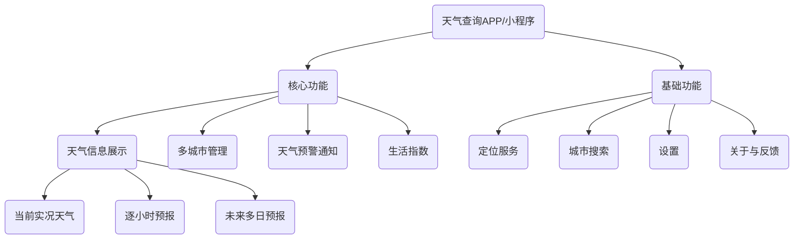

## 从零到一：打造一款接入高德API的天气查询小程序 (PRD)

#### 1.1 项目背景
随着智能手机的普及，天气应用已成为人们日常生活中不可或缺的工具。用户希望能随时随地、快速准确地获取天气信息，以便更好地安排出行和生活。当前市场上的天气应用功能繁杂，充斥着冗余信息和广告。为了提供一个纯粹、简洁、高效的天气查询体验，我们计划开发一款专注于核心天气功能的应用或小程序。

#### 1.2 项目目标
*   **核心目标:** 为用户提供一个界面简洁、操作便捷、数据精准的天气查询工具。
*   **用户目标:** 方便用户快速获取实时、未来多天的天气预报及生活指数，作为生活和出行的参考。

### 2. 产品需求

#### 2.1 产品功能结构图 (Function Map)

#### 2.2 功能详述

**2.2.1 核心功能**

*   **天气信息展示:**
    *   **当前实况天气:**
        *   **需求描述:** 用户打开应用后，首页默认展示当前定位城市的实时天气状况。
        *   **功能点:**
            *   城市名称
            *   当前温度
            *   天气状况 (如：晴、多云、雨、雪)
            *   体感温度
            *   风向与风力
            *   空气质量指数 (AQI)
            *   相对湿度
            *   数据更新时间
        *   **数据来源:** 高德天气API - 实况天气查询。
    *   **逐小时预报:**
        *   **需求描述:** 提供未来24小时内的精细化天气预报。
        *   **功能点:** 以时间轴的形式展示未来24小时内每个小时的天气状况、温度变化。
        *   **数据来源:** 高德天气API - 天气预报 (包含逐小时预报)。
    *   **未来多日预报:**
        *   **需求描述:** 提供未来7-15天的天气趋势预报。
        *   **功能点:**
            *   日期与星期
            *   天气状况
            *   最高/最低温度
            *   风向与风力
        *   **数据来源:** 高德天气API - 天气预报。
*   **多城市管理:**
    *   **需求描述:** 用户可以添加、删除、排序多个关注的城市，并能快速切换查看不同城市的天气。
    *   **功能点:**
        *   通过左右滑动或在城市管理列表中点击，切换查看不同城市的天气。
        *   城市管理列表页支持添加新城市、删除已关注城市和拖动排序。
*   **生活指数:**
    *   **需求描述:** 提供与日常生活相关的气象指数，为用户的行为决策提供参考。
    *   **功能点:** 展示如穿衣指数、运动指数、紫外线指数、感冒指数、洗车指数等。
    *   **数据来源:** 高德天气API - 天气预报 (extensions=all)。

**2.2.2 基础功能**

*   **定位服务:**
    *   **需求描述:** 首次打开应用时，请求用户授权地理位置，自动定位到当前城市。
    *   **功能点:**
        *   启动时自动定位。
        *   首页提供手动刷新定位的按钮。
        *   若定位失败或未授权，则提示用户手动选择城市。

*   **城市搜索:**
    *   **需求描述:** 用户可以通过输入城市中英文名称、拼音或区号来搜索并添加城市。
    *   **功能点:**
        *   支持模糊搜索和热门城市推荐。
        *   搜索结果列表展示，点击即可添加关注。
        *   **数据来源:** 高德地理编码/逆地理编码API，用于将城市名称转换为天气API所需的adcode。

*   **设置:**
    *   **需求描述:** 提供基础的个性化设置选项。
    *   **功能点:**
        *   温度单位切换 (摄氏℃ / 华氏℉)。
        *   推送通知开关。
        *   清除缓存。

*   **关于与反馈:**
    *   **需求描述:** 提供产品介绍、版本信息和用户反馈渠道。
    *   **功能点:**
        *   显示应用名称、Logo、版本号。
        *   数据来源说明 (例如：天气数据由高德开放平台提供)。
        *   提供联系方式或反馈表单，便于收集用户意见。

#### 2.3 非功能性需求
*   **性能需求:**
    *   应用/小程序启动时间应小于2秒。
    *   API请求响应时间在网络正常情况下应小于1秒。
    *   界面滑动流畅，无明显卡顿。
*   **兼容性需求:**
    *   **小程序:** 兼容主流版本的微信平台。
*   **数据准确性:**
    *   天气数据必须与高德API提供的数据保持实时同步，并明确展示数据发布时间。
*   **用户体验:**
    *   **界面设计:** 遵循简洁、直观的设计原则，避免信息过载。
    *   **交互设计:** 操作流程应尽可能简短，符合用户直觉。

### 3. API接入与开发流程

#### 3.1 高德天气API接入流程【详见‘’高德api.md‘’】
*   **返回格式:** JSON

#### 3.2 简要开发流程 (以小程序为例)
1.  **注册小程序账号:** 在微信公众平台注册并完善小程序信息，获取AppID。
2.  **环境搭建:** 下载并安装微信开发者工具。
3.  **项目创建:** 在开发者工具中新建一个小程序项目，填入AppID。
4.  **前端开发:**
    *   **UI设计与布局:** 使用 WXML 和 WXSS 构建页面结构和样式。
    *   **逻辑实现:** 在 JS 文件中编写页面逻辑，调用 `wx.request` 方法请求高德天气API。
6.  **测试:**
    *   在开发者工具的模拟器和不同真机上进行测试，覆盖不同机型和网络环境。
7.  **审核与发布:** 提交代码至微信平台进行审核，审核通过后即可发布上线。
